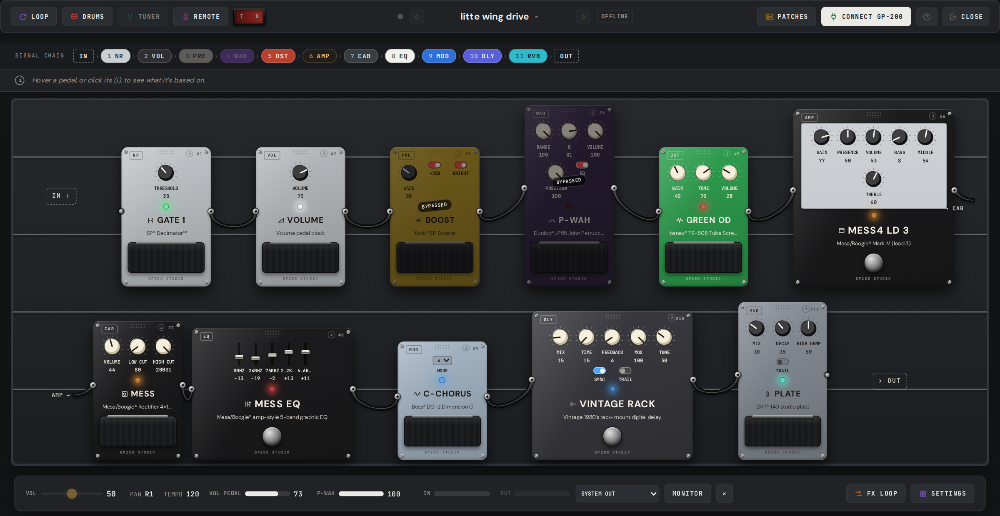

<div align="center">


# GP200 Studio

**A browser-based editor, patch manager and multi-layer loop station for the Valeton GP-200.**
No install, no account, no backend. Free and open source (GPL-3.0).

[](tsconfig.app.json)
[](package.json)
[](vite.config.ts)
[](src/core/SysExCodec.ts)
[](#how-it-works)
[](#getting-started)
[](LICENSE)

**[▶ Open the live app](https://kabirtamari.com/gp200studio/)** · **[☕ Buy me a coffee](https://buymeacoffee.com/kabir0st)**


</div>

## Why

The GP-200 is a great multi-effects pedal, but the official editor only runs on Windows and macOS, and organizing 256 patches through a 4" screen and two footswitches is slow going. This is the editor I wanted instead:

- **Runs anywhere Chrome runs**, Linux included. Web MIDI and Web Audio talk to the pedal over the USB cable you already have. Nothing to install.
- **Your patch looks like the gear it edits.** Every block is a pedal with knobs you can see and turn, so you read the signal chain at a glance instead of decoding menus.
- **Real patch management.** Browse, search, rename, import, export and back up all 256 slots, or dump the whole pedal to one ZIP.
- **A loop station the pedal doesn't ship with**, recording the GP-200's USB audio right in the browser.

## Features

- **Pedalboard editor.** Per-effect pedal bodies, drag to reorder, FX-loop routing, knobs and faders, and the real-world gear each of the 305 effects is based on. The chain wraps and stacks downward instead of running off-screen, the board scales itself to fit your window, and there are two stages: flip the red rocker in the top bar for lights-out.
- **Live device push.** Edits stream to a connected GP-200 over USB-MIDI SysEx as you make them, and changes made on the hardware sync back into the editor.
- **Patch manager.** All 256 slots with names and search, activate/open/rename, per-slot `.prst` import and export, one-click ZIP backup, plus a read-only list of the 30 user IR slots.
- **Patch settings in one drawer,** tabbed into Expression, Footswitches and Bulk Apply.
- **Controller assignment.** EXP1 mode A/B and EXP2 with heel/toe sweeps, a live EXP1 test slider, and CTRL 1 to 8 footswitch masks covering every block including the FX loop. Assignments travel with the patch, so they survive an export and a save to the unit.
- **Bulk apply.** Stamp the current patch's footswitch layout and/or a patch volume onto every patch or a range of banks. There is no bulk message in the protocol, so it walks the slots one at a time with a connected pedal, and it overwrites the targets. Take a ZIP backup first.
- **Loop station.** Your first take sets the master loop and every take after it becomes a new track, quantized and phase-locked to it. Per-track play, mute, volume and delete, audio-file import for backing tracks, and MIDI learn so the pedal's own footswitches drive record and play.
- **Drums.** A practice drum machine in the browser (kits, grooves, per-step editing, MPC-style swing, 4/4, 3/4, 2/4 and 6/8, and a style randomizer) that needs no GP-200 and keeps playing while you close the drawer. Below it sits a MIDI remote for the pedal's own drums, looper, tuner and tap tempo.
- **Remote and device readout.** Virtual CTRL taps, bank and patch stepping, direct tempo and the three Quick Access knobs over plain CC, plus a read-only view of the tuner reference, global EQ and drum kit names read during the connect handshake.
- **Works offline and on a phone.** Editing `.prst` files needs no device at all, and below 640px you get a purpose-built touch UI rather than a squashed board.

<details>
<summary><b>📸 More screenshots</b></summary>
<br/>
<table>
  <tr>
    <td></td>
    <td></td>
  </tr>
  <tr>
    <td align="center"><sub>Patch manager: 256 slots, search, file I/O</sub></td>
    <td align="center"><sub>Effect picker with the gear each effect models</sub></td>
  </tr>
  <tr>
    <td></td>
    <td></td>
  </tr>
  <tr>
    <td align="center"><sub>Loop station stacking takes over USB audio</sub></td>
    <td align="center"><sub>Practice drums, browser side and pedal side</sub></td>
  </tr>
  <tr>
    <td></td>
    <td></td>
  </tr>
  <tr>
    <td align="center"><sub>CTRL footswitch assignment</sub></td>
    <td align="center"><sub>Same board, lights out</sub></td>
  </tr>
</table>
</details>

## Getting started

1. Open **[GP200 Studio](https://kabirtamari.com/gp200studio/)** in Chrome or Edge (Web MIDI has no Firefox or Safari support).
2. Plug the GP-200 into USB and hit **CONNECT GP-200**, or open the editor without connecting to work on `.prst` files.
3. That's it. Everything runs client-side and your presets never leave your machine.

Running it locally:

```bash
git clone https://github.com/kabir0st/gp200-studio.git
cd gp200-studio
npm install
npm run dev        # http://localhost:5173
```

Also available: `npm run build`, `npm run typecheck`, `npm run lint`, `npm run test`.

## How it works

Everything is client-side TypeScript. A pure protocol layer in [`src/core/`](src/core/) decodes and encodes the GP-200's binary `.prst` format (byte-exact round-trips, unmodeled bytes passed through untouched) and speaks the pedal's reverse-engineered USB-MIDI SysEx protocol for parameter changes, effect swaps, toggles, reorders, preset pulls and saves. React hooks handle the connection and session on top of that, and the pedalboard UI sits on the hooks. No server is involved at any point.

## Privacy

Your presets stay on your machine. No account, no upload, no server-side storage.

The hosted site loads Google Analytics to answer questions like "does anyone use the looper?". Patch names, author fields, file names, MIDI port names and preset contents are never sent: every tracked value is a fixed keyword or a coarse bucket, and the full list of roughly a dozen events is in [`src/core/analyticsEvents.ts`](src/core/analyticsEvents.ts). Ad personalization is off, Global Privacy Control disables analytics entirely, and tracking is gated on a production build plus a hostname allowlist ([`src/core/analytics.ts`](src/core/analytics.ts)), so dev servers, tests and forks are silent. The measurement ID in `.env.production` is committed on purpose: GA4 IDs ship in the JS bundle of every site that uses them, so hiding it would buy nothing.

## Contributing

Bug reports, protocol captures from your hardware and pull requests are all welcome. Open an issue or PR on [GitHub](https://github.com/kabir0st/gp200-studio). If the app saves you from the 4" screen, you can also [buy me a coffee](https://buymeacoffee.com/kabir0st). ☕

## Credits

Built on the reverse-engineering groundwork of **[phash/gp200editor](https://github.com/phash/gp200editor)** (the `.prst` binary format, the SysEx protocol and the 305-effect mapping), by [Kabir Tamari](https://kabirtamari.com).

## License

[GPL-3.0](LICENSE). Free to use, study, share and improve; derivatives must stay open source.
