<div align="center">

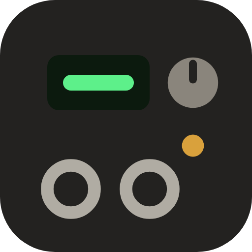

# GP200 Studio

### Your Valeton GP-200, on a big screen.

Build patches on a pedalboard you can actually see, manage all 256 of them,
and stack loops over your own playing. It runs in the browser, so there is
nothing to install and nothing to sign up for.

**[▶ Open the app](https://gp200studio.com/)** · **[☕ Buy me a coffee](https://buymeacoffee.com/kabir0st)**

[](#how-to-start)
[](#how-to-start)
[](LICENSE)

<picture>
  <source media="(prefers-color-scheme: dark)" srcset="public/guide/02-editor-board-dark.png" />
  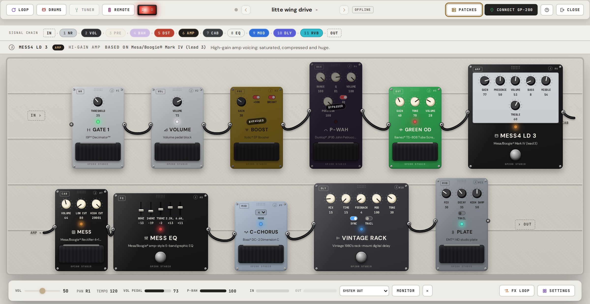
</picture>

</div>

---

## Why bother

The GP-200 sounds great. Setting it up does not. The official editor skips Linux
entirely, and building a patch on a 4" screen with two footswitches takes longer
than it should.

Plug the pedal into a laptop, a tablet or an Android phone with the USB cable you
already own, open a browser tab, and everything is in front of you at once.

<div align="center">
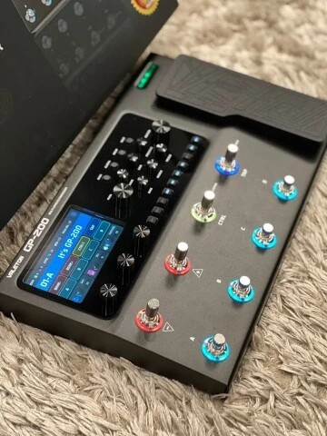
<br/>
<sub>The pedal this was built for.</sub>
</div>

<br/>

## Every block is a pedal

Your whole chain, laid out like a board. Turn a knob and you hear it on the pedal
straight away. Drag a pedal to move it, stomp its switch to bypass it, and the
cables follow along. That board up there is a real patch, not a mock-up.

Hover any pedal and the top strip tells you what it actually is. All 305 effects
are matched to the real amps and stompboxes they model, so "MESS4 LD 3" reads as
a Mesa/Boogie Mark IV instead of a code you have to look up.

<picture>
  <source media="(prefers-color-scheme: dark)" srcset="public/guide/04-info-bar-chain-dark.png" />
  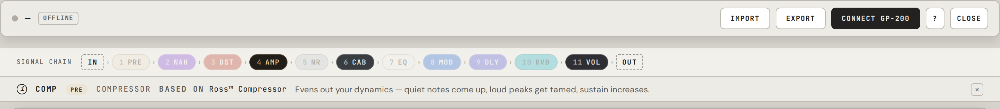
</picture>

Swapping an effect is a search box and a picture, not a menu tree. Browse by
category or type the name of the pedal you are after.

<picture>
  <source media="(prefers-color-scheme: dark)" srcset="public/guide/03-effect-picker-dark.png" />
  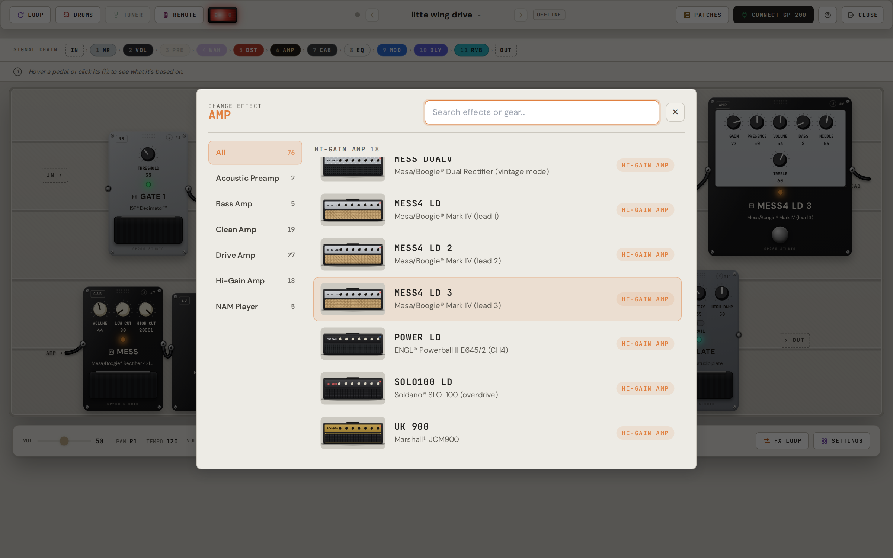
</picture>

<br/>

## A loop station the pedal doesn't have

The GP-200 records one loop. This records as many as you like. Your first take
sets the length, every take after it locks to that timing, and each one lands on
its own track with its own volume, mute and delete. Drop in an audio file and
play over a backing track.

One button does the recording, and it always tells you what pressing it will do
next: RECORD, then LISTENING while it waits for your first note, ARMED while it
waits for the downbeat, STOP while it runs, ADD A TAKE once a loop is going.
That gap between pressing record and hearing anything is the confusing part of
every looper, so this one just says what it is doing.

Best part: teach it your footswitches once and you never touch the laptop again
while you play.

<picture>
  <source media="(prefers-color-scheme: dark)" srcset="public/guide/08-deck-loop-dark.png" />
  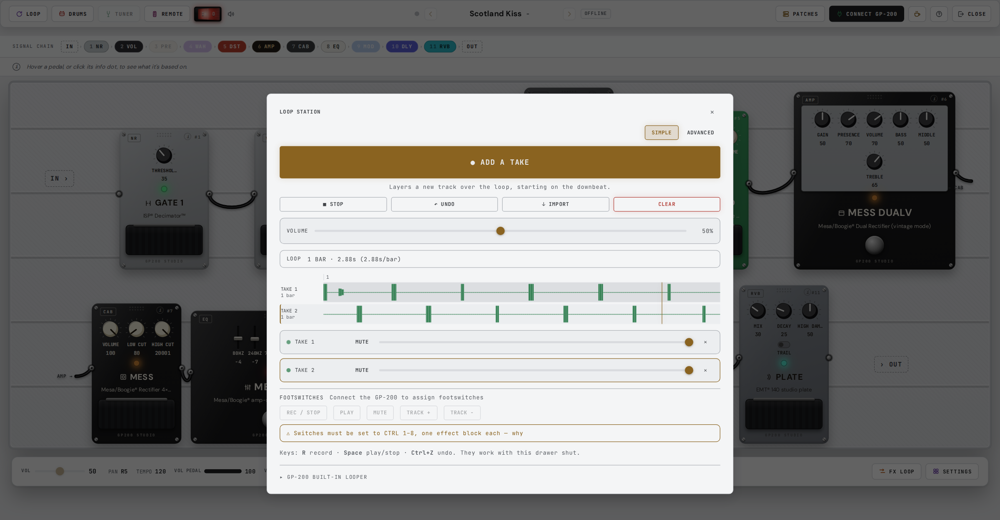
</picture>

<br/>

Flip it to **Advanced** when you want the rest: lock the bar to the drum machine
so there is no reaction time in your loop length, record a fixed number of bars
so the recorder stops itself, start on your first note instead of on the button,
set how much of the last chord rings across the loop point, and trim the timing
if your interface under-reports its latency.

<picture>
  <source media="(prefers-color-scheme: dark)" srcset="public/guide/12-loop-advanced-dark.png" />
  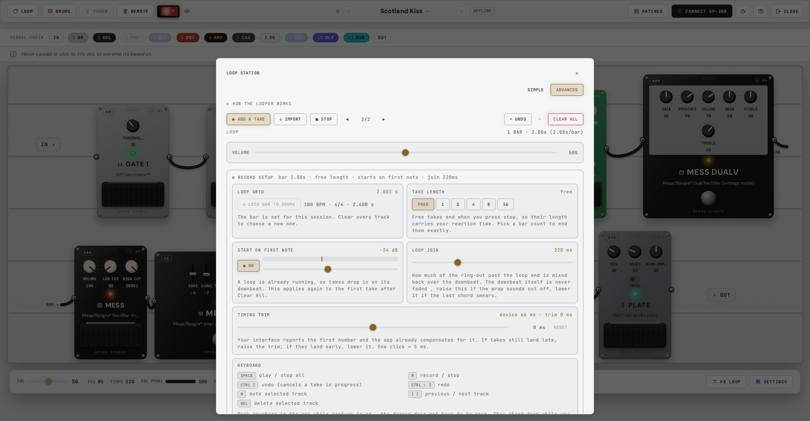
</picture>

<br/>

## Something to play against

A drum machine that lives in the browser, so it works with the pedal unplugged.
Pick a kit, pick a groove, nudge the swing, or hit RANDOM and see what you get.
Works in 4/4, 3/4, 2/4 and 6/8, and it keeps playing while you close the panel
and dial in a tone. The pedal's own drums, looper and tuner sit right below it.

<picture>
  <source media="(prefers-color-scheme: dark)" srcset="public/guide/11-drums-dark.png" />
  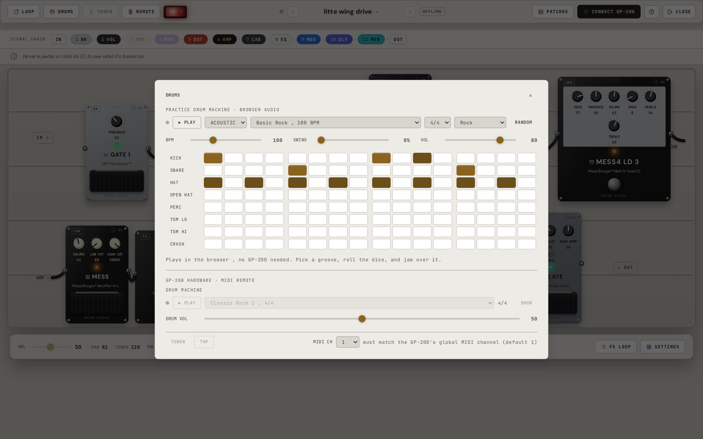
</picture>

<br/>

## Set up your footswitches once

<div align="center">

<br/>
<sub>The switches you are assigning. Photo: <a href="https://shop.valeton.net/products/gp-200">Valeton</a></sub>
</div>

<br/>

Tap a switch, tap the pedals it should turn on and off. One stomp can flip a
whole group at once. Expression pedals work the same way: pick a knob, set where
it lands heel down and toe down.

<table>
  <tr>
    <td><picture>
  <source media="(prefers-color-scheme: dark)" srcset="public/guide/07-deck-ctrl-dark.png" />
  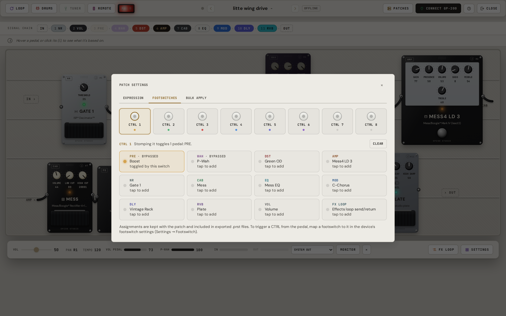
</picture></td>
    <td><picture>
  <source media="(prefers-color-scheme: dark)" srcset="public/guide/06-deck-exp-dark.png" />
  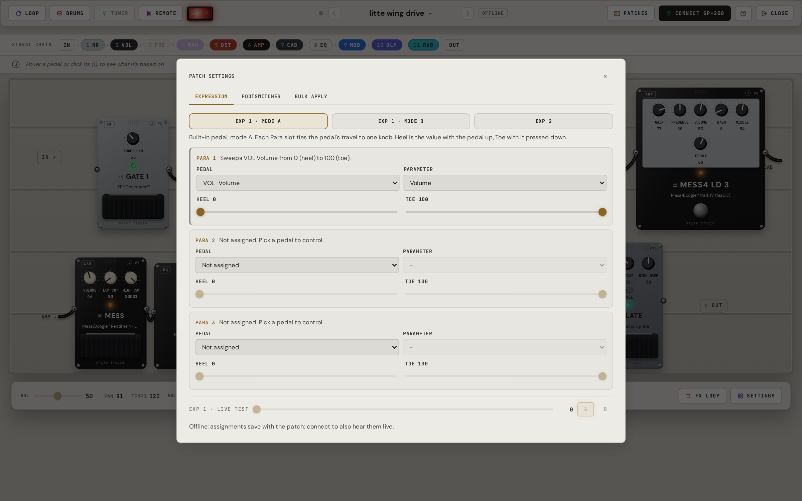
</picture></td>
  </tr>
  <tr>
    <td align="center"><sub>Footswitches</sub></td>
    <td align="center"><sub>Expression pedals</sub></td>
  </tr>
</table>

Got it how you like it? **Bulk Apply** copies that footswitch layout, and a patch
volume if you want, into every patch on the pedal or a stretch of banks. It is
the fix for the "I set this up 40 times by hand" problem. It does overwrite the
patches it touches, so back up first (one button, next section).

Your external pedals go anywhere in the chain too. Drag the send and return
arrows to wherever the loop belongs.

<picture>
  <source media="(prefers-color-scheme: dark)" srcset="public/guide/05-deck-fxloop-dark.png" />
  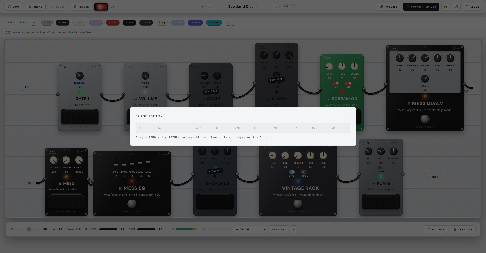
</picture>

<br/>

## All 256 patches, in one list

Search them, rename them, jump to one, open it, and back the whole pedal up to a
single zip file before you change anything. Individual patches import and export
as normal `.prst` files, the same ones the official editor uses, so nothing is
locked in here.

<table>
  <tr>
    <td><picture>
  <source media="(prefers-color-scheme: dark)" srcset="public/guide/10-patch-manager-dark.png" />
  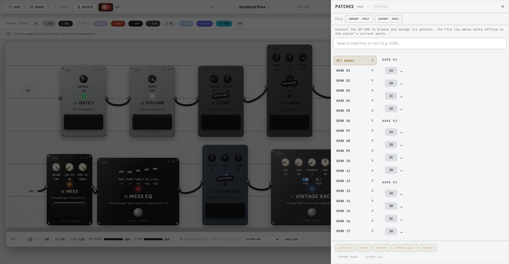
</picture></td>
    <td><picture>
  <source media="(prefers-color-scheme: dark)" srcset="public/guide/09-export-dialog-dark.png" />
  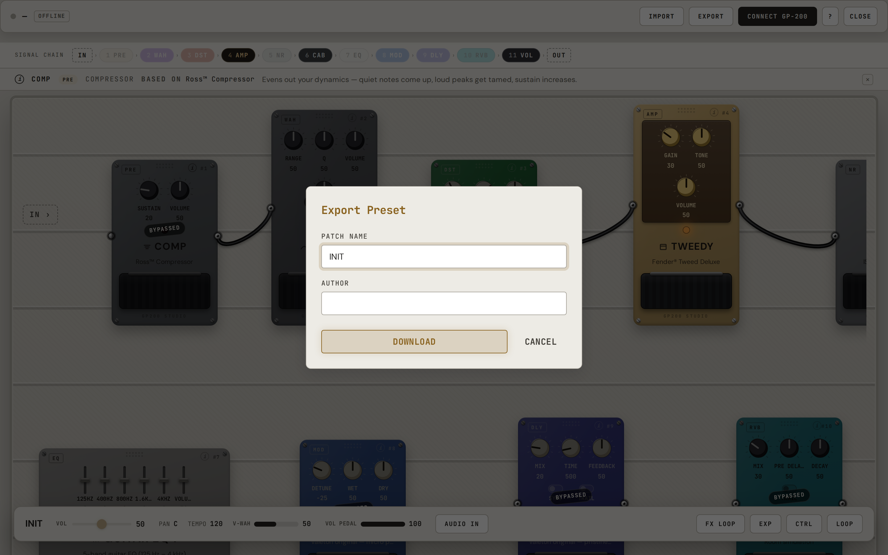
</picture></td>
  </tr>
  <tr>
    <td align="center"><sub>Every slot, searchable</sub></td>
    <td align="center"><sub>Save a patch to a file</sub></td>
  </tr>
</table>

<br/>

## Also on the board

There is a remote panel for the things that have no other home: tap CTRL
switches from the screen, step through banks and patches, set the tempo by
number, and read back what the pedal says about itself (tuner reference, global
EQ, drum kits).

And if the venue is dark, so is the app. Flip the red rocker in the corner.

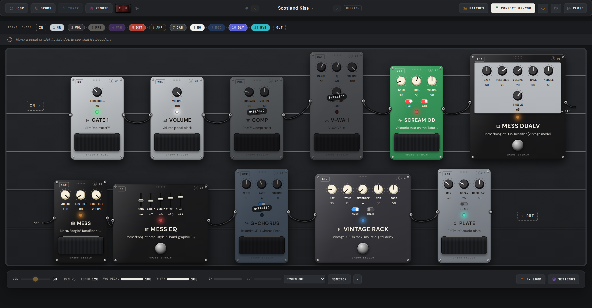

<br/>

## How to start
<br/>

<picture>
  <source media="(prefers-color-scheme: dark)" srcset="public/guide/01-landing-dark.png" />
  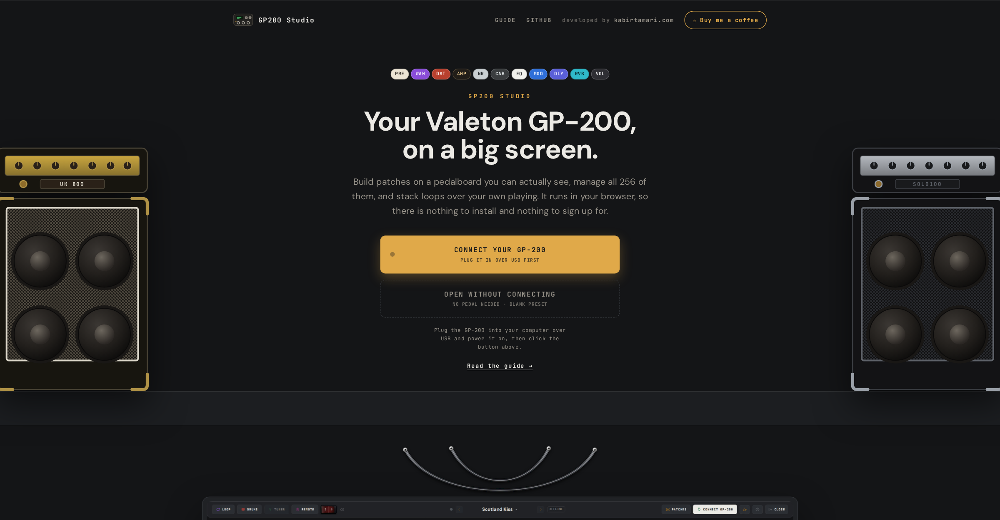
</picture>

1. Open **[GP200 Studio](https://gp200studio.com/)** in Chrome or Edge. Firefox and Safari cannot talk to USB MIDI yet, so they will not work.
2. Plug the GP-200 in over USB, turn it on, and hit **CONNECT GP-200**.
3. No pedal handy? Open the editor anyway and work on saved `.prst` files.

On a phone you get a layout built for thumbs rather than a shrunken board.

**Your presets stay with you.** No account, no upload, no server. Everything
happens inside your browser tab.

<br/>

## For the curious

<details>
<summary>Running it yourself</summary>
<br/>

```bash
git clone https://github.com/kabir0st/gp200-studio.git
cd gp200-studio
npm install
npm run dev        # http://localhost:5173
```

Also available: `npm run build`, `npm run typecheck`, `npm run lint`, `npm run test`.
</details>

<details>
<summary>How it works, briefly</summary>
<br/>

All of it is client-side TypeScript. [`src/core/`](src/core/) reads and writes the
GP-200's `.prst` files byte for byte, and speaks the pedal's USB-MIDI SysEx
protocol (worked out from USB captures) for knob changes, effect swaps, bypasses,
reordering, and pulling or saving whole patches. React hooks handle the
connection on top of that, and the pedalboard sits on the hooks. There is no
server anywhere in the picture.
</details>

<details>
<summary>About analytics</summary>
<br/>

The hosted site loads Google Analytics to answer questions like "does anyone use
the looper?". Patch names, author fields, file names, MIDI port names and preset
contents are never sent. Every tracked value is a fixed keyword or a rough
bucket, and the whole list of about a dozen events is in
[`src/core/analyticsEvents.ts`](src/core/analyticsEvents.ts). Ad personalization
is off, Global Privacy Control switches analytics off completely, and tracking
only runs on the hosted site, so dev servers, tests and forks are silent
([`src/core/analytics.ts`](src/core/analytics.ts)). The measurement ID in
`.env.production` is committed on purpose: GA4 IDs ship inside the JavaScript of
every site that uses them, so hiding it would buy nothing.
</details>

<br/>

## Thanks and license

Bug reports, protocol captures from your own pedal and pull requests are all
welcome on [GitHub](https://github.com/kabir0st/gp200-studio). If this saved you
from the 4" screen, [buy me a coffee](https://buymeacoffee.com/kabir0st). ☕

Everything else you see above is a screenshot of the app. GP-200
and Valeton are their trademarks; this project is not affiliated with or endorsed
by them.

Thanks for the initial reverse-engineering groundwork to
**[phash/gp200editor](https://github.com/phash/gp200editor)**: the `.prst` file
format and the SysEx protocol.

Made by [Kabir Tamari](https://kabirtamari.com). Free and open source under
[GPL-3.0](LICENSE), so it stays that way.
